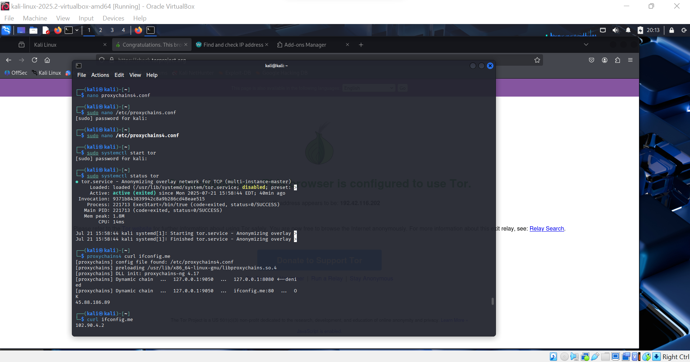
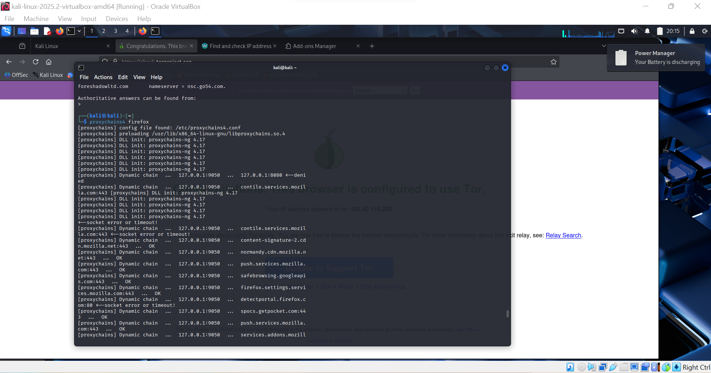
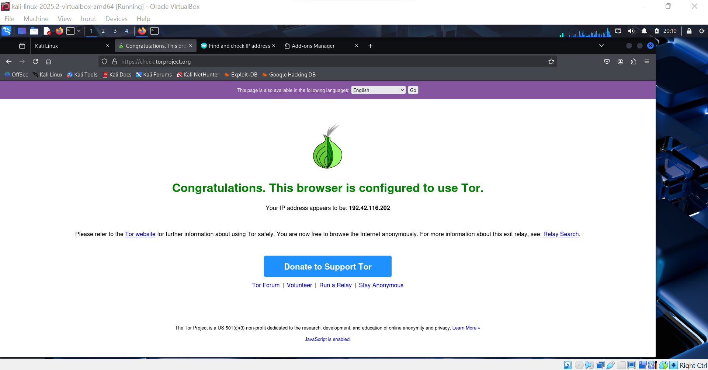

<a name="top"></a>
## Table of contents

- [Introduction](#Introduction)
- [Tools](#Tools)
- [Installation](#Installation)
- [Configuration](#Configuration)
- [Confirmation](#Confirmation)
- [Conclusion](#Conclusion)
- [Back to top](#top)
  

# Anonymous-Browser-Routing
Configure Tor and ProxyChains4 on Kali Linux to achieve anonymous Firefox browsing for cybersecurity, privacy, and ethical hacking purposes.
# Introduction
This documentation outlines the step-by-step experimental setup to achieve anonymous web access using Tor and ProxyChains4 on Kali Linux, with traffic routed through the Firefox browser. The goal is to mask the real IP address and enhance anonymity during penetration testing or private browsing.

---
### Tools
- Operating System : Kali Linux
- Browser : Firefox
- Proxy Routing Tools : Tor/Proxychains4
- Privileges : sudo/root
---
### Installation
```bash
sudo apt update
sudo apt install tor proxychains4 -y
```
---
### Step 2: Starting the Tor Service
```bash
sudo systemctl start tor
```
[Back to top](#top)

---
### Configuration
```bash
sudo nano /etyc/proxychains4.conf
```


---
### Edit the following lines:
At the top,enable dynamic chaining and DNS tunneling
```
dynamic_chain
proxy_dns
```
Under `[ProxyList]`, add 
```
[ProxyList]
socks5 127.0.0.1 9050 
http   127.0.0.1 8080
``` 
---
### step 4: closing firefox sessions
```bash
pkill firefox
```
---
### Step 5: Launch Firefox via ProxyChains
```bash
proxychains4 firefox
```


---
### Confirmation
open Firefox and navigate to:
```
http://check.torproject.org
```
if configured sorrectly, the site will display:
>"Congratulations. This Browser is configured to use Tor."

---
### Conclusion

This experiment successfully demonstrates how to set up **Firefox on Kali Linux** to use the **Tor network via ProxyChains4**, ensuring **anonymous, encrypted web access**. The setup is useful for **cybersecurity practitioners, penetration testers, privacy advocates**, and **researchers** who require **secure and anonymous communication**.

[Back to top](#top)
